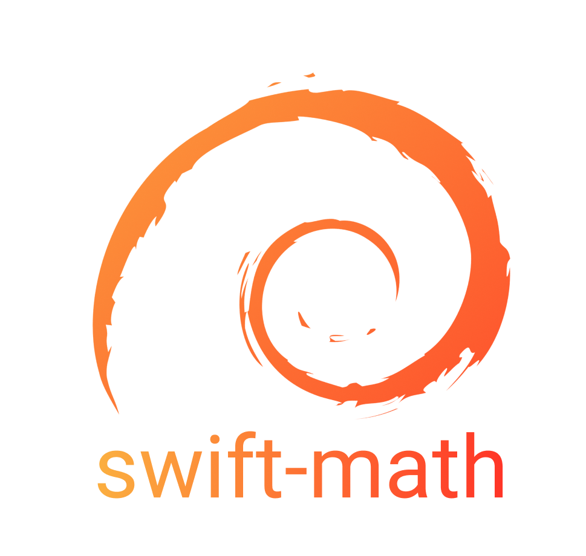

<p align="center">

</p>

| |
| :-: |
|  [](https://github.com/helbertgs/swift-math/actions/workflows/swift.yml)[](https://app.bitrise.io/app/d44fb074346957be) |


## Introduction

Swift Math contains a lot of mathematic functions based on C for Graphics (NVidia)

## Using Swift Math in your project

To use Swift Math in a SwiftPM project:

1. Add the following line to the dependencies in your `Package.swift` file:

```swift
.package(url: "https://github.com/helbertgs/swift-math", from: "1.0.0"),
```

2. Add `Math` as a dependency for your target:

```swift
.target(name: "MyTarget", dependencies: [
  .product(name: "Math", package: "swift-math"),
  "AnotherModule"
]),
```

3. Add `import Math` in your source code.

## Source stability

The Swift Math package is source stable; version numbers follow [Semantic Versioning](https://semver.org).
The public API of the `swift-math` package consists of non-underscored declarations that are marked either `public` or `usableFromInline` in modules re-exported by the top-level `Math` module, *excepting any API that involves a conformance to Differentiable (because Differentiable itself is not stable in Swift)*.
Interfaces that aren't part of the public API may continue to change in any release, including patch releases. 

We'd like this package to quickly embrace Swift language and toolchain improvements that are relevant to its mandate.
Accordingly, from time to time, we expect that new versions of this package will require clients to upgrade to a more recent Swift toolchain release.
Requiring a new Swift release will only require a minor version bump.

## Contributing to Swift Math

Swift Math is a standalone library that is separate from the core Swift project
Swift Math uses GitHub issues to track bugs and features. We use pull requests for development.

### How to propose a new module

1. Raise an issue with the [new module] tag.
2. Raise a PR with an implementation sketch.
3. Once you have some consensus, ask an admin to create a feature branch against which PRs can be raised.
4. When the design has stabilized and is functional enough to be useful, raise a PR to merge the new module to master.

### How to propose a new feature for an existing module

1. Raise an issue with the [enhancement] tag.
2. Raise a PR with your implementation, and discuss the implementation there.
3. Once there is a consensus that the new feature is desirable and the design is suitable, it can be merged.

### How to fix a bug, or make smaller improvements

1. Raise a PR with your change. 
2. Make sure to add test coverage for whatever changes you are making.

## Module(s).

1. [`Math`](Sources/Math/README.md)

## Future expansion